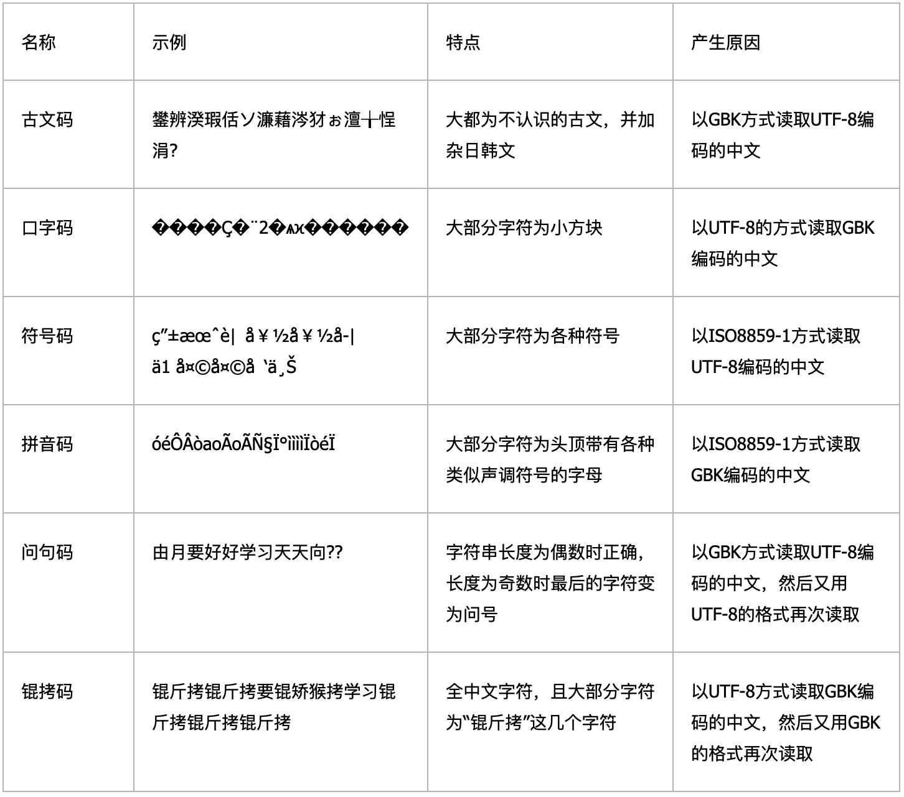

# 非常见问题

### 使用腾讯云COS与CDN提示跨域的解决方案

> 参考链接：
>
> 2. [设置跨域访问](https://cloud.tencent.com/document/product/436/11488)


##### 各种乱码原因及示例



### chrome下启用媒体设置对ip地址访问有安全限制

> 本地ip127.0.0.1及localhost无此限制

通过chrome://flags/#unsafely-treat-insecure-origin-as-secure 添加 Insecure origins treated as secure 并启用

```
http://172.16.100.70:2099
```

## HBuilderX，UniApp相关

### HBuilderX使用mac打包ios应用提示苹果根证书没有安装

https://blog.csdn.net/jia12216/article/details/118151791

https://ask.dcloud.net.cn/article/37979

### HBuilderX下打wap2app包时，ios下提示不能通过getUserMedia方式获取录音权限

修改mainfest.json配置文件指定为**WKWebview**,默认是UIWebview ，该方式已被ios废弃，通过UIWebview的app将不可以上架应用市场和更新

```
"kernel" : {
	"ios" : "WKWebview"
},
```

- 云打包面板下的bundle id (appid) 为ios下创建的Profiles下的appid ，同时跟mainfest.json下的apple->appid保持一致

```
"apple" : {
	"appid" : "com.voiceaitech.master-h5",
	/*iOS应用标识，苹果开发网站申请的appid，如io.dcloud.HelloH5*/
```

```bash
keytool -genkey -alias testalias -keyalg RSA -sigalg SHA1WithRSA -validity 36500 -keysize 1024 -keystore test.keystore -v
```


